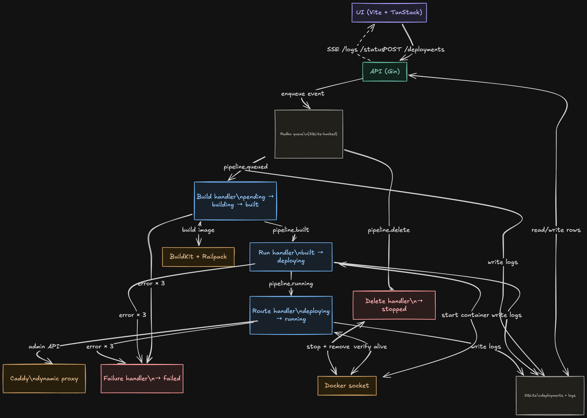
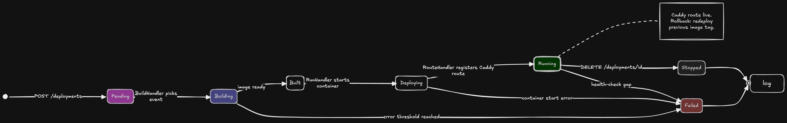

# System Architecture: Not Brimble

This project implements a one-page deployment pipeline for containerized applications, designed to mirror the operational logic of a fully functional PaaS.

## Diagrams

System layout and runtime data flow:

Editable source: [open in Excalidraw](https://excalidraw.com/#json=mVSG56LlvNlFO_96qTM_H,VZd9nGo9PXH_dILmm0zRLQ).

## Architectural Overview

The system is designed as an Event-Driven Architecture (EDA) to ensure that heavy infrastructure tasks (building images, managing containers) remain decoupled from the user-facing API.

### 1. The Decision for EDA
Instead of a synchronous request-response model, I opted for an asynchronous pipeline.

- **Why:** Building and deploying containers are long-running operations. Synchronous systems would lead to timeouts and a brittle user experience.
- **How:** The API validates the user's intent and publishes an event. A dedicated Worker pool consumes these events, allowing the system to handle multiple builds in parallel without blocking.

### 2. State & Messaging: Redka (Redis on SQLite)
To maintain a lean "Single-Command" (`docker compose up`) setup while gaining the power of Redis-like semantics, I used Redka.

- **Reasoning:** Redka provides Redis-compatible data structures (Lists for queues, Strings for state) but persists them in SQLite. `PopFront` is atomic, which is enough to let worker replicas scale out later without corrupting queue state.
- **Benefit:** No separate Redis container — the pipeline backbone rides on the same SQLite file that stores deployment rows.
- **Trade-off:** Redka exposes list operations only — no Pub/Sub, no blocking pops, no visibility timeouts. That shapes two design choices: the log stream uses an in-process notify broker (worker → API HTTP POST → channel wake) instead of Redis Pub/Sub, and a crashed worker mid-build still loses its event (a real job queue with ACKs is on the "next weekend" list).

### 3. Reliability & Retries
The pipeline implements a "fail-forward" approach:

- **Retries:** The worker includes an exponential backoff mechanism. If a transient infrastructure error occurs (e.g., BuildKit or Docker Socket congestion), the event is requeued up to 3 times before being marked as failed.
- **State Integrity:** Deployment status transitions are managed as a linear state machine (`pending` -> `building` -> `built` -> `deploying` -> `running`).

### 4. Technical Stack Decisions
- **Worker/Pipeline:** Written in Go for high-performance concurrency and low-level system interaction.
- **Frontend:** Built with Vite + TanStack (Router + Query). It treats the source code as a "Service" rather than just a build list, allowing for the Service-grouped UI.
- **Ingress:** Caddy serves as the dynamic reverse proxy. The worker pushes route configuration to Caddy's Admin API in real-time as containers become healthy.
- **Builds:** Railpack is used to abstract away Dockerfile complexity, producing standard OCI images from both Git repositories and uploaded archives.

## Key Features

- **Live Logs:** Real-time build/deploy logs streamed via SSE.
- **Rollback/Redeploy:** First-class support for rolling back to previous image tags by reusing existing builds.
- **Hard-Requirement Compliance:** Entirely self-contained in a single Docker Compose stack.

## Documentation

The API includes a modern reference UI powered by Scalar.

- **Interactive Docs:** Available at `/docs` (e.g., `http://localhost:8080/docs`).
- **Theme:** Dark mode enabled for consistency with the system aesthetic.
- **Specification:** Automatically generated using `swag` annotations in the Go source.

## State Synchronization

On worker startup the process reconciles Caddy's in-memory route table with the `deployments` table before draining any queued events. For each deployment marked `running`, the worker verifies via `docker inspect` that the container is actually up; if it is, the Caddy route is idempotently re-registered (delete-then-add, so a pre-existing route doesn't 409 us). 

A missing container leaves the row untouched — we surface the drift rather than silently flipping state — so a later health-check pass can decide whether to restart the container or fail the deployment. This lets `docker compose restart` or a Caddy container swap complete without orphaning live URLs, and without the API needing any infrastructure access.

## Separation of Concerns

The API and worker each open their own SQLite connection pool (one for deployment data, one for the redka queue). That's deliberate: in a production build the queue would be Redis Streams / NATS JetStream rather than redka, at which point the two pools become two *different* data stores. 

Keeping them isolated now mirrors that eventual shape and keeps the API container free of the Docker socket and Caddy admin credentials — only the worker holds those.
