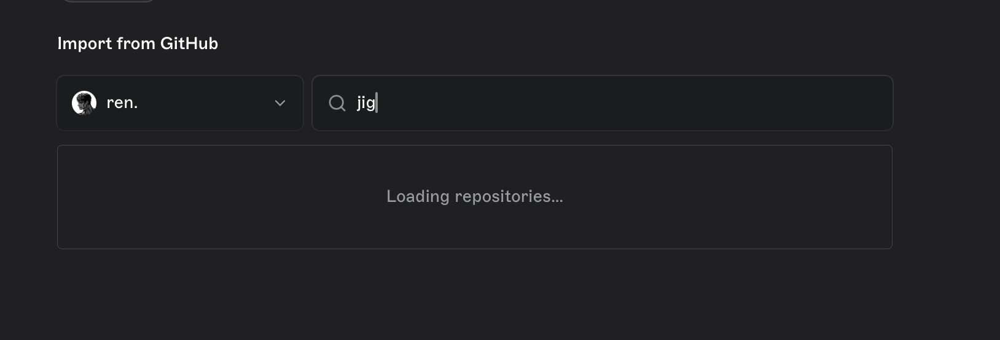
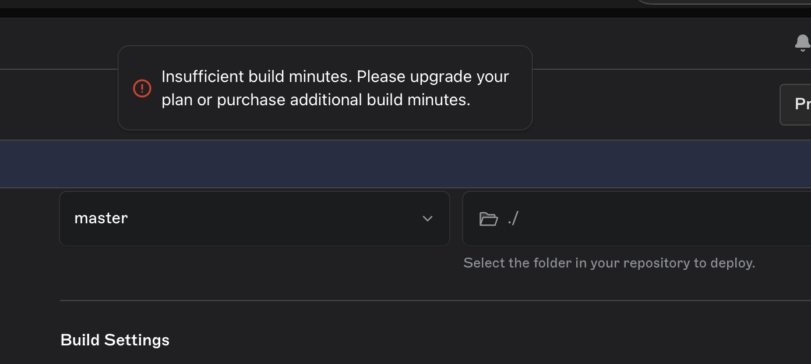
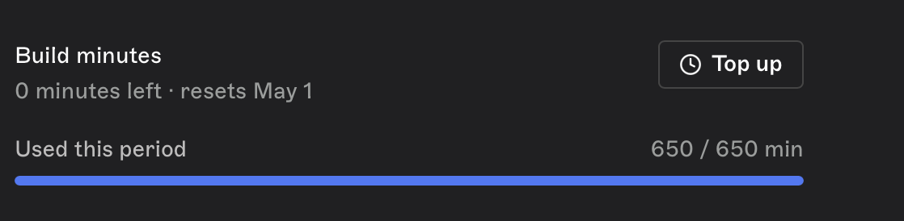
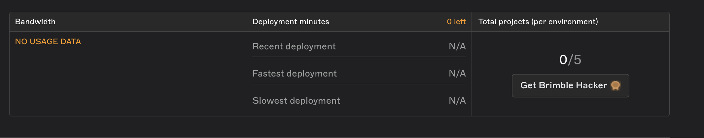
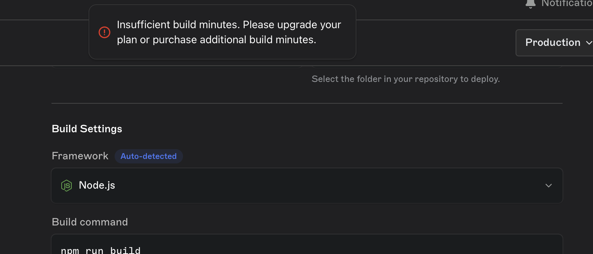
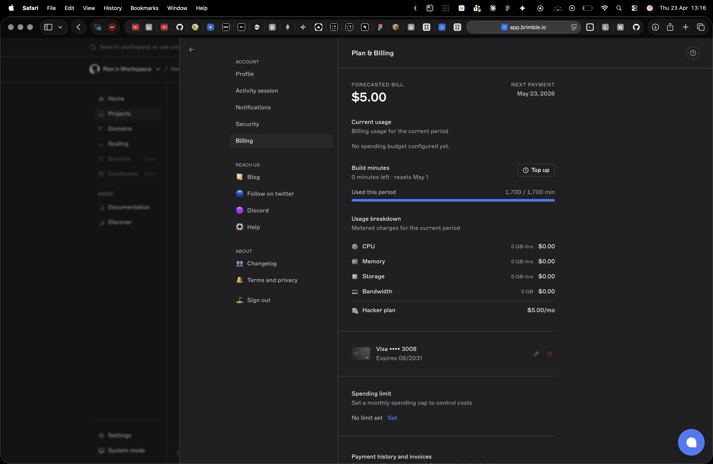

# Deployment Feedback: Brimble Platform

Technical feedback from a paid-plan deploy of a production project on Brimble. Submitted alongside the "build a mini PaaS" take-home so the comparisons land in context.

## 1. Signup & onboarding

The core flow is genuinely smooth — chef's kiss to whoever owns that surface. Two small notes:

- **Latency:** The first popup took a noticeable beat to appear. Could be a Safari quirk on my end rather than the platform.
- **Permission Sequencing:** The upfront "Add the Brimble app" GitHub permission prompt creates friction before the user has committed to anything. Personal POV: grant access to the dashboard first, defer the GitHub app install to the moment the user actually clicks "New Deploy". Same permission, better sequencing — the ask feels earned instead of gatekeeping.

## 2. Non-standard project structure (template engine)

I deliberately picked a project other PaaS providers have historically struggled with — the engine and its HTML templates need to be served together, and Vercel/Render both hit architectural bottlenecks here. Brimble routed it correctly.

One highlight: even though my project's build system emitted noisy 'Error rendering route' logs to stderr, Brimble correctly identified that the overall process completed successfully (exit 0). It didn't let the noisy logs derail the pipeline, ensuring a reliable transition to the running state. This level of 'log-agnostic' reliability is a huge plus for complex build tools.

**Status:** Resolved after quota support (shout out to @pipe_dev). Deploy is live.

## 3. Repository search performance

During the "New Project" flow, the repo search appears to fire a network round-trip per keystroke — noticeable latency, feels heavy.

**Recommendation:** 300ms debounce on the input, plus a one-time prefetch of the user's repo list on dashboard load so most searches resolve client-side.

  
*Figure 1: High-frequency network requests during repository search.*

## 4. Build minutes & quota (resolved via support)

The most blocking issue I hit, now cleared. Chronology:

- **Fresh signup:** ~650 build minutes allocated.
- **Next day:** Balance zeroed out with no successful deploys on my account.
- **Hacker plan upgrade:** Balance jumped to ~1700 minutes.
- **Blocker:** Platform reported "Maxed Out" despite the active subscription and visible credit.

Support resolved it same-day, but the chain of states suggests either a quota counter that keeps ticking against failed/cancelled builds or a display/state mismatch between billing and the build gate. Worth an audit of where that counter decrements.

  
*Figure 2: Unexpected depletion of build minutes.*

  
*Figure 3: Platform reporting "Maxed Out" status despite available credit.*

  
*Figure 4: Active Hacker Plan subscription.*

  
*Figure 5: Discrepancy between reported usage and quota limits.*

  
*Figure 6: Confirmed payment and plan status.*

## 5. Build logs & build lifecycle

A few observations from watching my own build stream. Context: the project I deployed uses a build system that's known for false-positive parse errors during the build step — at runtime a direct start works fine.

- **Notifications on build completion:** I walked away from the dashboard during the build and had no way to know when it finished or failed. A "build status" email (or browser push) for the owner of a deploy would close that loop.
- **Log copy UX:** When I was debugging my build output I tried to copy the log lines. The "copied to clipboard" confirmation is subtle enough that I repeated the action a few times before spotting the toast. Expanding that affordance — larger toast, brief highlight on the copied range — would save the user that little "did it work?" moment.

## 6. UI polish

Overall the dashboard is clean and the path to a deploy is unambiguous. One visual snag:

- **Styling Drift:** The "Add Card" button in the payment flow doesn't quite match the surrounding design language — alignment/styling feels slightly off relative to the rest of the dashboard.

  
*Figure 7: Styling drift in the payment method interface.*

## 7. Custom domains

Didn't attempt this pass, I do have an unused domain sitting around that I plan to try next. Happy to send follow-up notes once I do.

## Summary

Net positive. The core deploy loop is the strongest part of the product: I got a non-trivial project live where two larger PaaS competitors had failed me, and the support response turned a blocking quota bug into a same-day unblock. 

The friction points — repo-search latency, the quota state mismatch, build-lifecycle gaps, and a couple of UX subtleties — are all concrete and fixable without touching the core architecture. Would recommend, and plan to move more of my side projects over.
